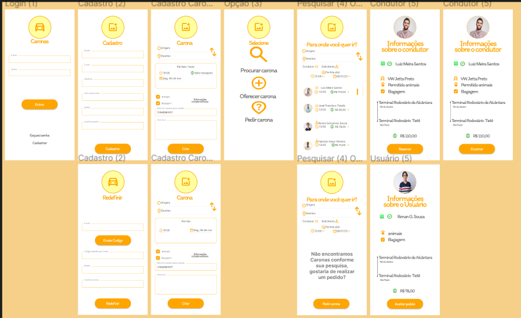

# CaronasPort

<h1 align="center"> Caronas App </h1>

Aplicativo de Caronas.

 
  

 

## 🚀 Tecnologias

Esse projeto está sendo desenvolvido com as seguintes tecnologias:

- HTML e CSS 
- JavaScript
- Git e Github
(React Native - em breve)

## 💻 Projeto

Na região norte de Minas Gerais, é recorrente a prática de compartilhamento de caronas entre cidades vizinhas mediante uma contribuição financeira para auxílio no custeio da gasolina. Embora existam grupos dedicados a essa finalidade no WhatsApp e Facebook, as publicações nesses meios carecem de uma padronização consistente, o que gera confusão tanto para os usuários que buscam caronas quanto para os condutores que as oferecem.

Diante desse desafio identificado, surgiu a concepção do Caronas App. Este aplicativo propõe uma solução estruturada e eficiente ao reunir usuários que disponibilizam caronas, aqueles que buscam esse serviço e indivíduos que solicitam caronas. O diferencial reside na implementação de um formato padronizado para as publicações, abrangendo informações essenciais como local de partida, destino, horário, valor da contribuição, detalhes adicionais e informações de contato.

Ao adotar esse enfoque organizado, o Caronas App visa simplificar e aprimorar a experiência dos usuários, proporcionando maior clareza, transparência e facilidade na busca e oferta de caronas na região. Esta iniciativa visa otimizar a comunicação entre aqueles que compartilham veículos e fortalecer a prática de caronas de maneira segura e eficiente.

----------------------------------------------------------------------------------------------------------------------
